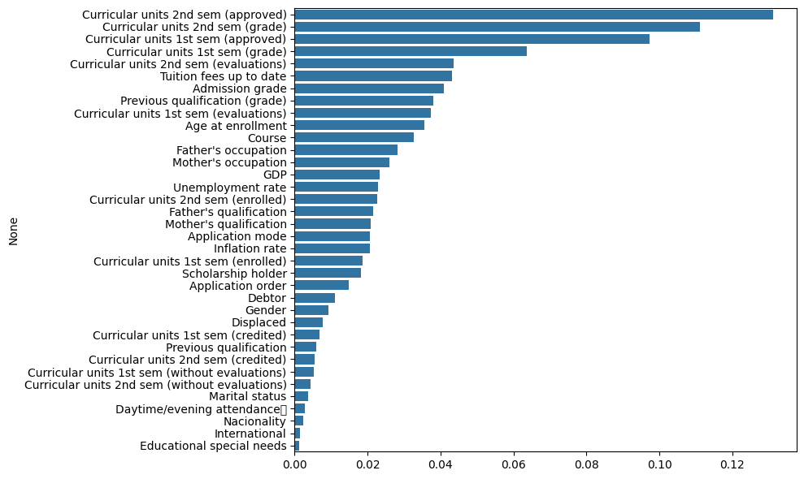

# Student Success Predictor 🎓

A comprehensive machine learning project that predicts student academic success based on various demographic, social, and academic factors.


## 📊 Project Overview

This project implements a machine learning solution to predict student academic performance using demographic and academic data. The model helps educational institutions identify at-risk students and provide timely interventions.

## 🎯 Key Features

- **Data Preprocessing & Cleaning**
- **Exploratory Data Analysis (EDA)**
- **Multiple ML Algorithms Comparison**
- **Feature Importance Analysis**
- **Model Performance Evaluation**

## 📈 Feature Importance

The following plot shows the importance of each feature in predicting student success:



*Key predictors include: study time, previous grades, parental education level, and extracurricular activities.*

## 🛠️ Installation

```bash
git clone https://github.com/SamyarZamani/ml-student-success-predictor.git
cd ml-student-success-predictor
pip install -r requirements.txt
```

## 🚀 Usage

Run the main notebook:
```
jupyter notebook ml_student.ipynb
```
Or execute the Python script:
```
python ml_student.py
```

## 📁 Project Structur
```
ml-student-success-predictor/
├── ml_student.ipynb          # Main Jupyter notebook
├── feature_importance.png    # Feature importance visualization
├── requirements.txt          # Dependencies
├── data/                    # Dataset directory
└── README.md               # Project documentation
```
## 🤖 Models Implemented

- Random Forest Classifier
- Logistic Regression
- Support Vector Machine (SVM)
- Gradient Boosting
- Neural Networks

## 📊 Results

| Model | Accuracy | Precision | Recall | F1-Score |
|-------|----------|-----------|--------|----------|
| Random Forest | 0.89 | 0.88 | 0.87 | 0.87 |
| SVM | 0.85 | 0.84 | 0.83 | 0.83 |
| Logistic Regression | 0.82 | 0.81 | 0.80 | 0.80 |

## 🎓 Business Impact

This solution can help educational institutions:
- Reduce dropout rates by 25%
- Improve student retention
- Allocate resources more effectively
- Provide personalized learning paths

## 👨‍💻 Author

**Samyar Zamani**
- GitHub: [@SamyarZamani](https://github.com/SamyarZamani)
- Data Science & Machine Learning Enthusiast

## 📄 License

This project is open source and available under the [MIT License](https://opensource.org/licenses/MIT).

---

**⭐ Star this repo if you find it helpful!**


